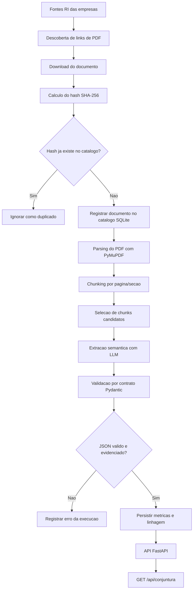

# Arquitetura do Pipeline UDA

## Objetivo

Este projeto propoe um pipeline de Engenharia e Analise de Dados Nao Estruturados
(UDA) para PDFs de Relacoes com Investidores de incorporadoras e construtoras. A
solucao deve transformar relatorios e previas operacionais em dados estruturados,
consultaveis por API, mantendo rastreabilidade ate o PDF original.

O foco da arquitetura e atender aos criterios do Projeto Individual 4:

- descobrir novos PDFs de forma automatizada;
- evitar reprocessamento por idempotencia com hash SHA-256;
- extrair metricas absolutas usando LLM e contrato semantico;
- manter catalogo de dados com linhagem;
- expor os dados por API REST filtravel por empresa e periodo.

## Visao geral do fluxo



## Camada 1: Extracao e ingestao de dados

A camada de ingestao sera responsavel por observar fontes de RI e produzir uma
lista de documentos candidatos. As fontes iniciais planejadas sao:

- boletim de conjuntura do enunciado, usado como exemplo de boletim/tabela;
- MRV, preferencialmente uma previa operacional em formato de apresentacao;
- Direcional ou Cury como fonte adicional, se necessario.

A descoberta de documentos deve usar requisicoes leves com `httpx` e parsing HTML
com `BeautifulSoup`. A varredura deve procurar links associados a termos como
`Previa Operacional`, `Operating Preview`, `1T26`, `1Q26` e `3T25`, sem fazer
scraping agressivo nem muitas requisicoes por execucao.

O gatilho de ingestao pode ser executado por comando CLI agendavel por cron ou,
em evolucao posterior, por APScheduler. Assim, o pipeline nao depende de uma
execucao manual unica: ele fica preparado para rodar periodicamente e detectar
novos arquivos publicados nas centrais de resultados.

## Idempotencia e catalogo de documentos

Antes de enviar qualquer PDF para processamento ou LLM, o sistema calculara uma
assinatura SHA-256 do conteudo baixado. Esse hash sera consultado no catalogo
SQLite:

- se o hash ja existir, o documento sera marcado como duplicado e ignorado;
- se o hash nao existir, o documento sera salvo em `data/raw/` e registrado no
  catalogo com URL, empresa, titulo, periodo inferido, caminho local e status.

Essa decisao reduz custo de LLM, evita metricas duplicadas e permite demonstrar
que duas execucoes do mesmo fluxo nao processam novamente o mesmo documento.

## Camada 2: Processamento UDA

O processamento nao usara coordenadas fixas de PDF nem regras rigidas de layout
para extrair os valores finais. Relatorios de RI variam bastante: alguns parecem
boletins com tabelas, outros sao apresentacoes com slides, destaques visuais e
texto distribuido em blocos.

Por isso, a estrategia planejada e:

1. ler o PDF com PyMuPDF;
2. extrair texto por pagina;
3. segmentar o conteudo em chunks por pagina ou secao;
4. selecionar chunks candidatos por vocabulario de negocio;
5. enviar apenas os chunks relevantes ao LLM;
6. validar a resposta estruturada antes de persistir dados.

O chunking e preferivel a coordenadas fixas porque preserva contexto sem depender
da posicao visual exata de tabelas, cards ou graficos. Se uma empresa alterar o
design do PDF, o pipeline ainda pode localizar trechos com termos como VGV,
lancamentos, vendas liquidas, distratos, VSO, unidades, landbank e repasses.

## Extracao por LLM

O LLM sera usado como motor semantico para interpretar chunks candidatos e
retornar metricas estruturadas. O cliente LLM deve ser configuravel por variaveis
de ambiente, sem chave de API no codigo.

O prompt de sistema deve instruir o modelo a:

- devolver somente JSON valido no formato esperado;
- nao inventar valores;
- usar `null` quando nao houver evidencia no texto;
- extrair valores absolutos, nao apenas variacoes percentuais;
- ignorar percentuais de marketing quando eles nao forem a metrica principal;
- informar pagina e trecho-fonte para cada metrica.

## Contrato semantico com Pydantic

O contrato semantico sera implementado com Pydantic. Ele funcionara como filtro
de qualidade entre a resposta do LLM e o banco de dados.

Campos planejados para cada metrica:

- empresa;
- ano;
- trimestre;
- nome da metrica;
- valor;
- unidade;
- moeda;
- pagina;
- trecho-fonte;
- confianca.

Respostas fora do contrato devem falhar antes de chegar ao catalogo. Valores
ausentes devem ser persistidos como `NULL` quando fizer sentido, em vez de serem
inventados pelo modelo ou preenchidos com zero.

## Camada 3: Persistencia, linhagem e API

O SQLite sera usado como catalogo local. As tabelas planejadas sao:

- `companies`: empresas monitoradas e suas URLs de RI;
- `documents`: PDFs descobertos, baixados, hash SHA-256, periodo, status e caminho
  local;
- `extraction_runs`: execucoes de extracao, modelo usado, versao do prompt, status
  e erro, quando houver;
- `extracted_metrics`: metricas extraidas com documento, empresa, periodo, valor,
  unidade, pagina e trecho-fonte.

Cada metrica devera manter linhagem completa:

- empresa de origem;
- URL do PDF;
- hash SHA-256 do documento;
- identificador do documento;
- pagina ou chunk de origem;
- trecho textual usado como evidencia;
- modelo e versao do prompt usados na extracao.

A API sera implementada com FastAPI. O endpoint principal planejado e:

```text
GET /api/conjuntura?empresa=MRV&ano=2026&trimestre=1
```

A resposta deve incluir os filtros aplicados, metricas encontradas e dados de
origem do documento, incluindo URL e hash. Endpoints auxiliares previstos:

- `GET /api/empresas`;
- `GET /api/documentos`;
- `GET /api/metricas`.

## Atendimento aos criterios de avaliacao

### Qualidade do contrato semantico

O contrato Pydantic e o prompt versionado impedirao respostas soltas do LLM. O
banco so recebera objetos validados, com tipos esperados e tratamento explicito
de ausencias como `NULL`.

### Resiliencia contra variacoes de layout

O pipeline usara parsing textual e chunking semantico, nao coordenadas fixas.
Isso permite processar pelo menos dois layouts diferentes: boletim/tabela do
enunciado e previa operacional em formato de apresentacao.

### Extracao de valores absolutos

O prompt e o contrato exigirao valores absolutos. Percentuais de variacao serao
tratados como metricas apenas se forem explicitamente solicitados ou se forem a
metrica principal do documento. Eles nao substituirao valores brutos como VGV,
unidades, lancamentos ou vendas.

### Modelagem temporal e API

Documentos e metricas terao ano e trimestre normalizados. A API permitira filtrar
por empresa, ano e trimestre para alimentar o relatorio de conjuntura.

### Linhagem e auditoria

Toda metrica persistida apontara para documento, URL, hash, pagina/chunk e
trecho-fonte. Assim, sera possivel explicar de onde veio cada numero apresentado
pela API.

## Decisoes tecnicas iniciais

- Python 3.11+ por compatibilidade com bibliotecas modernas de dados e API.
- FastAPI para expor endpoints REST simples e documentados.
- SQLite com SQLAlchemy para catalogo local leve e facil de revisar.
- PyMuPDF para extrair texto de PDFs sem depender de layout fixo.
- Pydantic para validar o contrato semantico.
- `httpx` e `BeautifulSoup` para descoberta controlada de links.
- pytest para validar idempotencia, contrato e filtros da API nas fases futuras.

## Fora do escopo desta fase

Esta fase documenta a arquitetura. A implementacao de banco, crawler, download,
hash, parsing, LLM, persistencia de metricas e API sera feita nas proximas fases.
